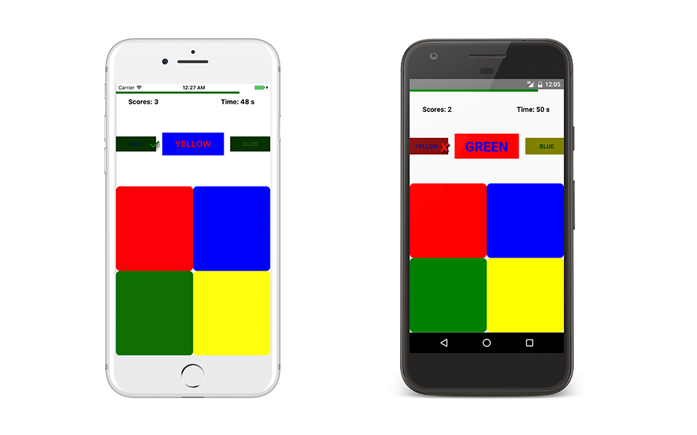
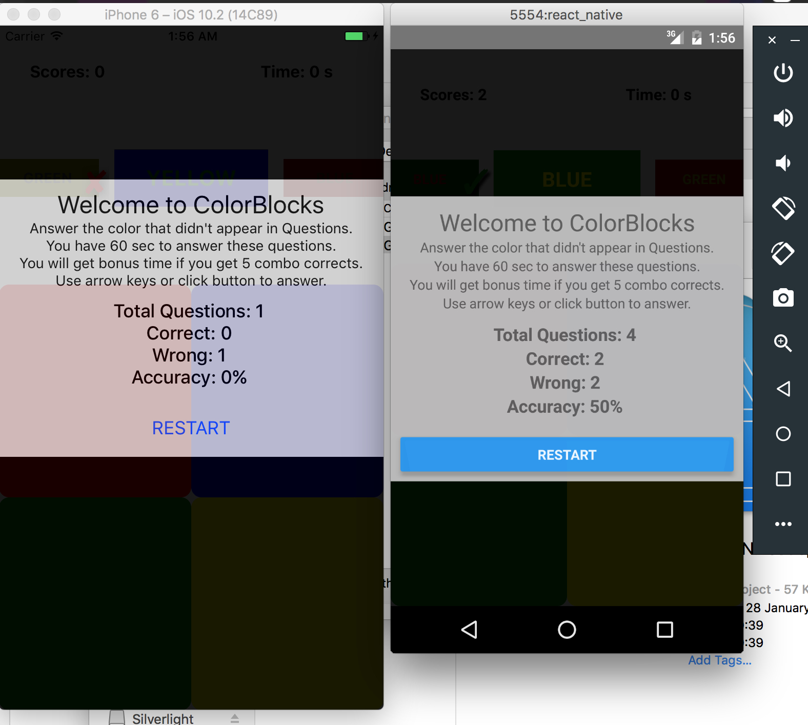
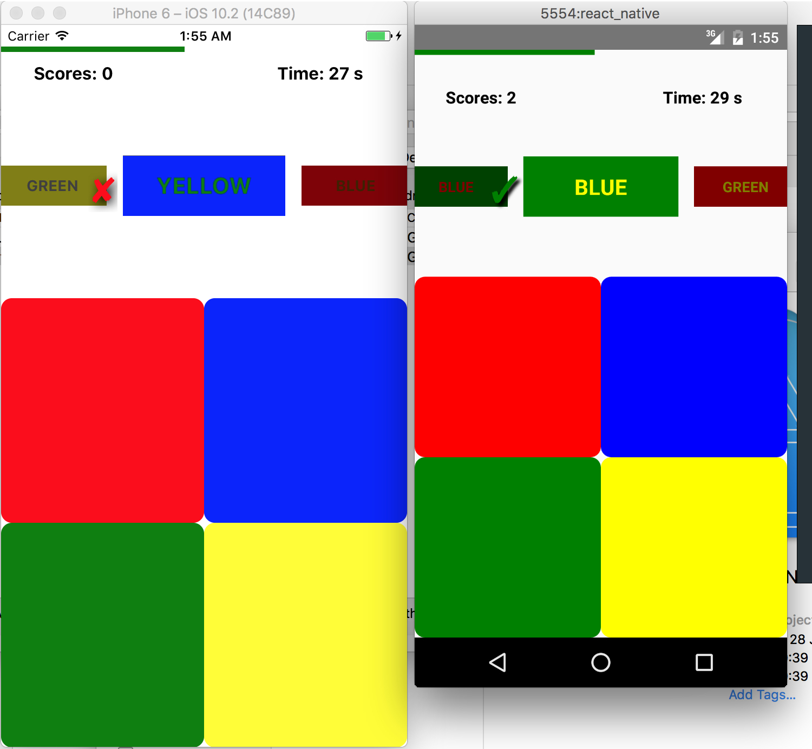

# ColorBlocks - React Native

A fun puzzle game for both iOS and Android devices, implemented with React Native.  
The code-base are **99.9%** same for iOS and Android version.  
  
It is ported from my original React version [colorblocks-react](https://github.com/SSARCandy/colorblocks-react)


```
=======================================================================
                      !!  Welcome to COLOR - BLOCK !!
=============================Introduction==============================
           Answer the color that didn't appear in Questions.
               You have 60 sec to answer these questions.
          You will get bonus time if you get 10 combo corrects.
=======================================================================
```
## Screenshots



  

## Run The Project

### Android

1. Start android emulator
2. `react-native run-android`

### iOS

1. Start iOS simulator
2. `react-native run-ios`
